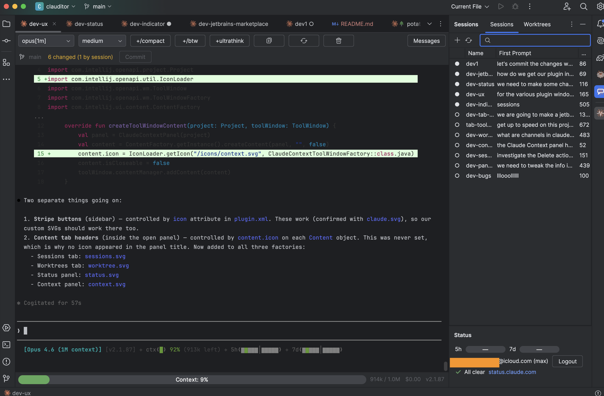

# Clauditor

[](https://plugins.jetbrains.com/plugin/30981-clauditor)

A JetBrains IDE plugin for managing [Claude Code](https://docs.anthropic.com/en/docs/claude-code) sessions. Browse, resume, fork, and monitor Claude sessions directly from your editor — with built-in git worktree support.

> Requires IntelliJ 2024.3+ and Claude CLI installed.



## Features

### Session Management

Sessions open as virtual editor tabs — side by side with your source files, not hidden in a terminal panel. Each tab is a fully interactive Claude terminal with its own toolbar, git status, and context bar.

<!--  -->

- **Resume** any previous session with double-click
- **Fork** a session to branch off from a conversation
- **Rename** and **delete** sessions from the UI
- **Purge** old sessions in bulk — enter a number of days and see a live count before deleting
- **Restore** open sessions across IDE restarts
- **Drag and drop** files (images, code, etc.) onto a session tab to insert their paths
- Split, drag, and arrange session tabs just like any editor tab

<!--  -->

### Worktree Sessions

Run isolated Claude sessions in git worktrees. Each worktree gets its own branch and working directory, so Claude can make changes without touching your main tree.

- Create worktrees from the Sessions panel
- Dedicated toolbar with **commit**, **create PR**, **rebase**, and **merge** controls
- Open worktree directory in a separate IDE window or file manager
- Branch status: ahead/behind tracking vs. your project branch

<!--  -->

### Git Toolbar

Every session editor shows the git state of its working directory:

- Current branch name and file change count
- **Session-aware diffing** — distinguishes files changed by Claude from files with mixed changes
- One-click commit of session-only changes

<!--  -->

### External Session Detection

Clauditor detects Claude sessions running outside the IDE (iTerm, VS Code, other terminals) and shows them in the session list with a distinct indicator.

- Sessions open externally show the **↗** icon and grayed-out text
- If a persisted tab's session is open externally when the IDE restarts, the tab shows an info panel instead of conflicting with the external terminal
- A **Resume** button auto-enables when the external session closes

<!--  -->

### Live Status Monitoring

Real-time visibility into what Claude is doing:

- **Tab indicators** — see at a glance which sessions are thinking, waiting for permission, or idle
- **Context usage** — progress bar showing how much of Claude's context window is consumed
- **Model info** — displays which model the session is using

<!--  -->

### Rate Limits & Auth

The Status tool window tracks your API usage:

- 5-hour and 7-day rate limit bars (green/yellow/red)
- Logged-in account and subscription type
- Anthropic system status from [status.claude.com](https://status.claude.com)
- Toggleable vertical/horizontal layout

<!--  -->

### Context Browser

Browse and insert Claude's configuration from the Context tool window:

- **Rules** — project and personal `.claude/rules/` files
- **Agents** — custom agent definitions
- **Skills** — slash command skills with metadata
- Double-click to open in editor, or insert directly into a running session

<!--  -->

### Message History

A collapsible sidebar in each session editor lists every user message in the conversation. Click a message to scroll the terminal to that point.

<!--  -->

## Requirements

- **IntelliJ IDEA** 2024.3 or later (Community or Ultimate)
- **Claude CLI** installed and in your `PATH` ([install guide](https://docs.anthropic.com/en/docs/claude-code/getting-started))
- Authenticated via `claude login`

## Installation

### From source

```bash
git clone https://github.com/bdkent/clauditor.git
cd clauditor
./gradlew buildPlugin
```

The built plugin ZIP will be in `build/distributions/`. Install it via **Settings → Plugins → ⚙ → Install Plugin from Disk**.

### Development

```bash
./gradlew runIde
```

This launches a sandboxed IDE instance with the plugin loaded.

## Usage

1. Open a project that has Claude Code sessions (any project where you've run `claude`)
2. Open the **Sessions** tool window (right sidebar)
3. Double-click a session to resume it, or click **+** to start a new one
4. Use the **Worktrees** tab to run isolated sessions on separate branches

## Architecture

```
src/main/kotlin/com/clauditor/
├── editor/          Session editor, virtual files, tab titles, icons
├── services/        Session loading, terminal PTY, status polling, context scanning
├── toolwindow/      Sessions list, status bar, context browser, message history
├── terminal/        PTY output filtering, activity detection
├── model/           Data classes (sessions, status, context items)
└── util/            Path encoding, process detection, custom UI components
```

The plugin embeds Claude CLI as a PTY process, injects lightweight hooks to capture status and tool-use events, and polls status files to keep the UI in sync — no modifications to Claude's own configuration.

## License

[MIT](LICENSE)
